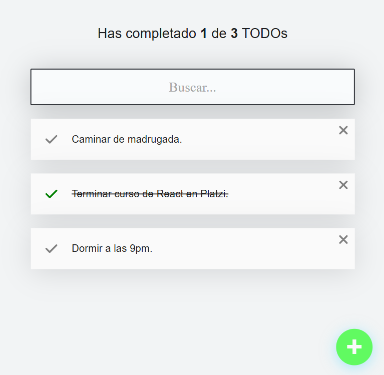
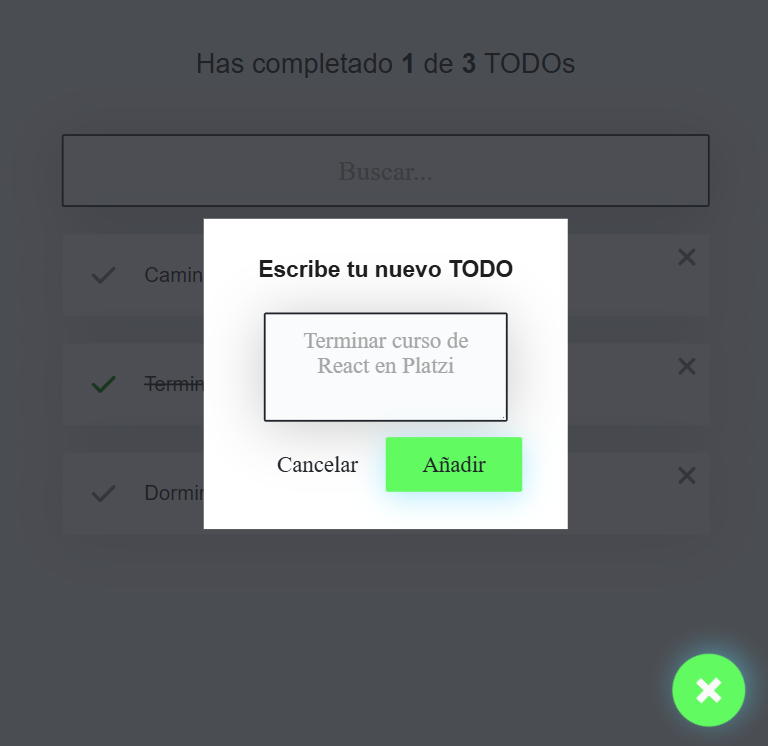

# Todo App 📝

## Capturas de Pantalla

|  |  |
|----------------------------------------|----------------------------------------|
| **Pantalla principal**                 | **Formulario para agregar TODOs**      |

**Todo App** es una aplicación sencilla de lista de tareas desarrollada en React.js que permite agregar, marcar como completadas y eliminar tareas. Este proyecto fue realizado como parte del [Curso de React.js](https://platzi.com/cursos/react/) en Platzi, y despliega la aplicación a través de GitHub Pages.

## 🖥️ Demo

Puedes acceder a la demo de la aplicación aquí: [Todo App en GitHub Pages](https://fabianvegadev.github.io/todo-app-platzi/)

## 📌 Características

- **Añadir Tareas:** Permite agregar nuevas tareas a la lista.
- **Completar Tareas:** Las tareas pueden marcarse como completadas.
- **Eliminar Tareas:** Las tareas pueden eliminarse de la lista.
- **Interfaz Intuitiva:** Diseño sencillo y fácil de usar.

## 🚀 Tecnologías Utilizadas

- **React.js:** Biblioteca principal utilizada para construir la interfaz de usuario.
- **JavaScript:** Lenguaje de programación base de la app.
- **CSS:** Para el diseño y estilo de la aplicación.
- **GitHub Pages:** Utilizado para desplegar la aplicación y permitir el acceso en línea.

---

Desarrollado con 💻 y ☕ por <a href="https://github.com/fabianvegadev">Fabian Velasquez</a>

---
